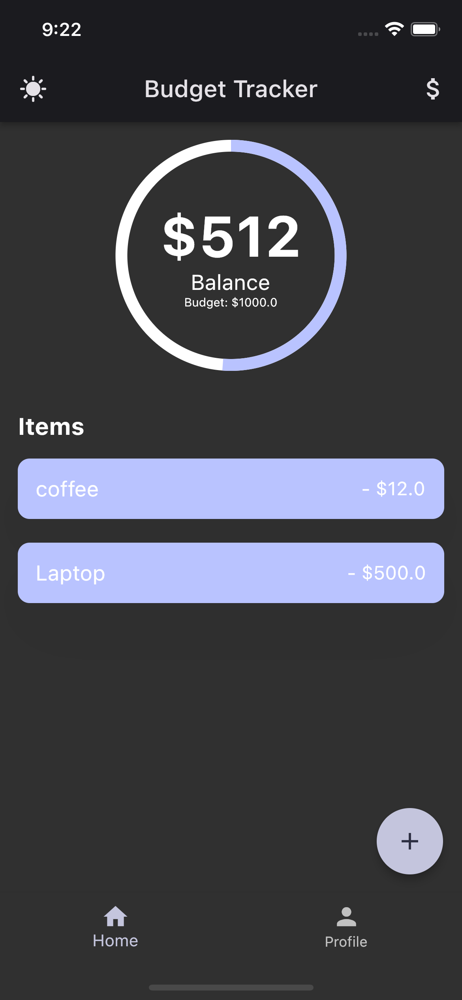
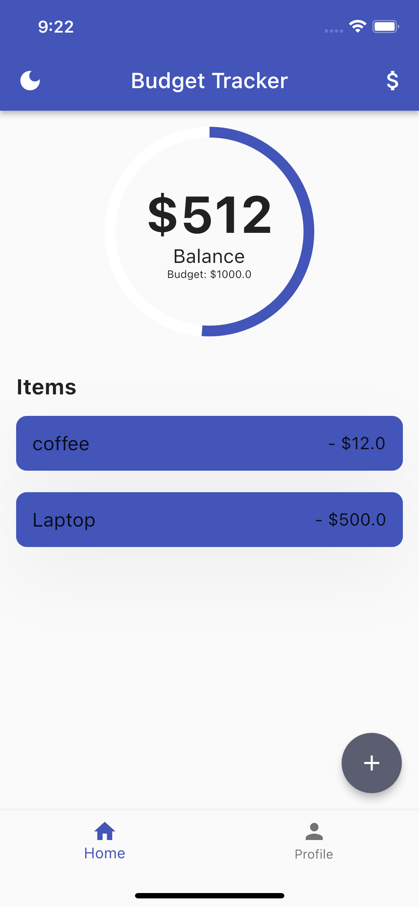
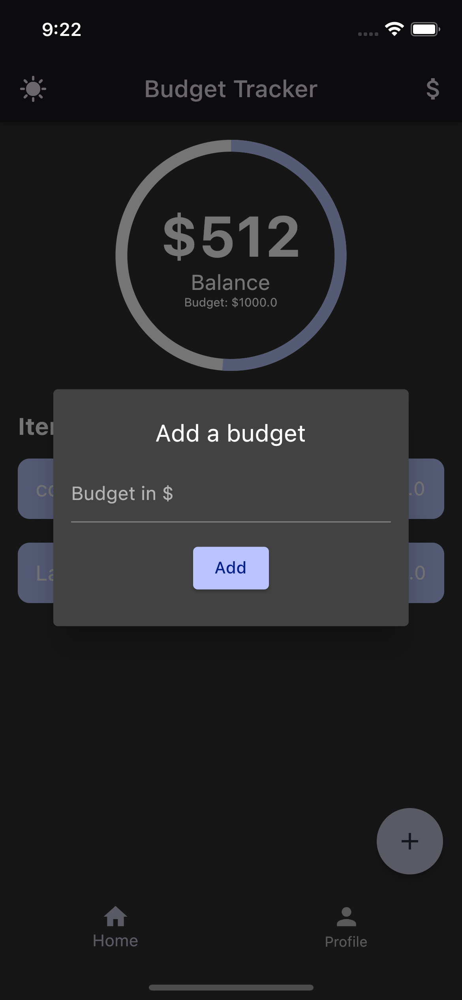
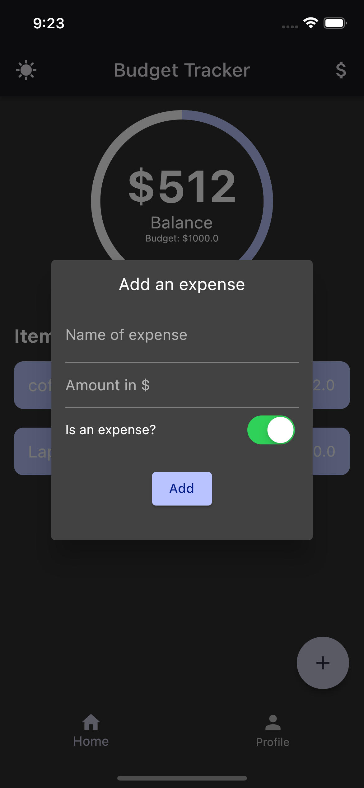

# budget_tracker

Learning how to implement a package into a flutter app, implementing a theme and then using hive to store data locally

## Tools used

It is using provider for statemanagement and hive for local storage

## Screenshots

| Dark mode | Light mode |
| ----------- | ----------- |
|  |  |

| Set budget | Add expense |
| ----------- | ----------- |
|  |  |